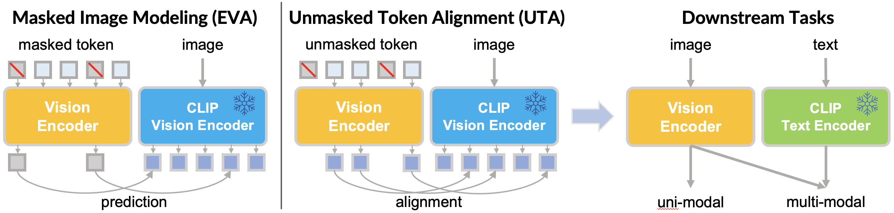

## Unmasked Token Alignment (UTA) for Efficient Visual-Language Representation Learning



This repository provides the inference code for our TMLR paper "Enhancing Vision-Language Model with Unmasked Token Alignment".

### **Abstract:**

Contrastive pre-training on image-text pairs, exemplified by CLIP, becomes a standard technique for learning multi-modal visual-language representations. Although CLIP has demonstrated remarkable performance, training it from scratch on noisy web-scale datasets is computationally demanding. On the other hand, mask-then-predict pre-training approaches, like Masked Image Modeling (MIM), offer efficient self-supervised learning for single-modal representations. This paper introduces Unmasked Token Alignment (UTA), a method that leverages existing CLIP models to further enhance its vision-language representations. UTA trains a Vision Transformer (ViT) by aligning unmasked visual tokens to the corresponding image tokens from a frozen CLIP vision encoder, which automatically aligns the ViT model with the CLIP text encoder. The pre-trained ViT can be directly applied for zero-shot evaluation even without training on image-text pairs. Compared to MIM approaches, UTA does not suffer from training-finetuning inconsistency and is much more training-efficient by avoiding using the extra [MASK] tokens. Extensive experimental results demonstrate that UTA can enhance CLIP models and outperform existing MIM methods on various uni- and multi-modal benchmarks.

### **Models:**

We release three pre-trained models:

| Model | Zero-shot Accuracy (ImageNet-1K) | Link |
|----|----|----|
| UTA-B | 77.0% | [weights](https://huggingface.co/jjjjh/UTA/tree/main/checkpoints) |
| UTA-L-pix336 | 81.4% | [weights](https://huggingface.co/jjjjh/UTA/tree/main/checkpoints) |
| UTA-g-pix336 | 83.9% | [weights](https://huggingface.co/jjjjh/UTA/tree/main/checkpoints) |

### **Getting Started:**

1. **Clone this repository:**
   ```bash
   git clone https://github.com/jihaonew/UTA.git
   cd UTA
   ```

2. **Install dependencies:**
   ```bash
   pip install -r requirements.txt
   ```

3. **Download the pre-trained models:**
   You can download the pre-trained models from [weights](https://huggingface.co/jjjjh/UTA/tree/main/checkpoints).

4. **Run inference:**
   The inference code is provided in `imagenet_zeroshot_eval.py`. You can use the following command to run ImageNet zeroshot eval:
   ```bash
   python imagenet_zeroshot_eval.py --imagenet-path [path to imagenet] --model [model name] --ckpt-path [path to checkpoint]
   ```

4. **Run demo:**
   You can also run `demo.py` to inference one image.
   ```bash
   python demo.py
   ```

### **Citation:**

If you find this work helpful, please cite our paper:

```
@article{
    liu2024enhancing,
    title={Enhancing Vision-Language Model with Unmasked Token Alignment},
    author={Jihao Liu and Jinliang Zheng and Boxiao Liu and Yu Liu and Hongsheng Li},
    journal={Transactions on Machine Learning Research},
    issn={2835-8856},
    year={2024},
    url={https://openreview.net/forum?id=JkFEVbW6wE},
    note={}
}
```
g
### **Contributing:**

Contributions to this repository are welcome. Please feel free to open an issue or submit a pull request.

### **Contact:**

If you have any questions or suggestions, please feel free to contact [Jihao Liu](https://jihaonew.github.io/) ([email](mailto:jihaoliu@link.cuhk.edu.hk)).
